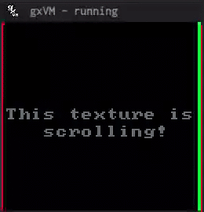

This is the "rewrite" of gxarch, with a better instruction set and better registers. There is no assembler, save RAM support, etc. For the old gxarch, choose the branch `v1`.

## Features
* 8-bit system with 16-bit arithmetic
* 64K shared RAM/ROM, 32 registers
* 24 instructions
* 128 × 128 screen


## Example

```
; %0 = scroll counter
; %1 = 1 (scroll increment)
; %2 = 0 (draw location)
; %3 = 128 (screen size)

dat main         ; program entry point

main:
	set %1 1
	set %2 0
	set %3 128

loop:
	add %0 %1 %0 ; increment scroll counter
	dw  %0 %0 %3 ; take a 128×128 area from the tileset at %0, %0
	at  %2 %2    ; and draw it at 0, 0
	end          ; draw frame
	jmp loop
```



## Memory Map
* `0x0000 - 0xEFFF` Shared ROM/RAM
  * ROM is loaded at `0x0000`.
  * The first two bytes of ROM indicate the entry point address.

* `0xF000 - 0xFEFF` Save RAM
  * The contents of SRAM are saved to a file when exiting.
  * Must be enabled by setting the SRAM toggle `0xFF01` to 1.
  * If disabled, this is just part of ROM/RAM.

* `0xFF00 - 0xFFFF` Reserved
  * `0xFF00` Currently pressed key
  * `0xFF01` SRAM toggle
  * `0xFF02` Random number