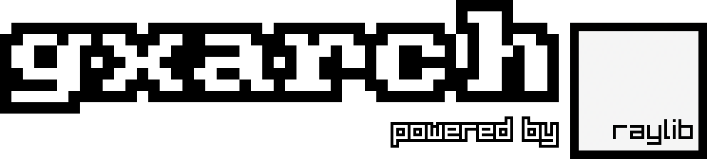

## Features
* 8-bit system with [16-bit arithmetic](https://github.com/gtrxAC/gxarch/wiki/Instructions#add-reg1-reg2-reg3-add)
* [64K shared RAM/ROM, 4K save file support](https://github.com/gtrxAC/gxarch/wiki/Memory-Map)
* 32 registers
* [24 instructions](https://github.com/gtrxAC/gxarch/wiki/Instructions)
* 128 × 128 screen, 16 colors
* [6 example programs and counting!](https://github.com/gtrxAC/gxarch/tree/main/examples)


## Example

```
; %0: scroll counter

dat main         ; program entry point

main:            ; define constants
    set %1 1     ; %1: scroll increment
    set %2 0     ; %2: draw location
    set %3 128   ; %3: screen size

loop:
    add %0 %1 %0 ; increment scroll counter
    dw  %0 %0 %3 ; take a 128×128 area from the tileset at %0, %0
    at  %2 %2    ; and draw it at 0, 0
    end          ; draw frame
    jmp loop
```


# Building

## Linux
1. Clone gxarch.
2. Build raylib following [this tutorial](https://github.com/raysan5/raylib/wiki/Working-on-GNU-Linux).
3. Run `build.sh`.

## Windows
1. Clone gxarch.
2. Download [w64devkit](https://github.com/skeeto/w64devkit/releases):
* `w64devkit-x.x.x.zip` for 64-bit
* `w64devkit-i686-x.x.x.zip` for 32-bit
3. Download [raylib](https://github.com/raysan5/raylib/releases):
* `raylib-x.x.x_win64_mingw-w64.zip` for 64-bit
* `raylib-x.x.x_win32_mingw-w64.zip` for 32-bit
4. Extract the `include` and `lib` folders from raylib into this directory.
5. Extract w64devkit and run `w64devkit.exe`.
6. Inside w64devkit, go to the directory where you cloned gxarch and run `build_win.sh`.